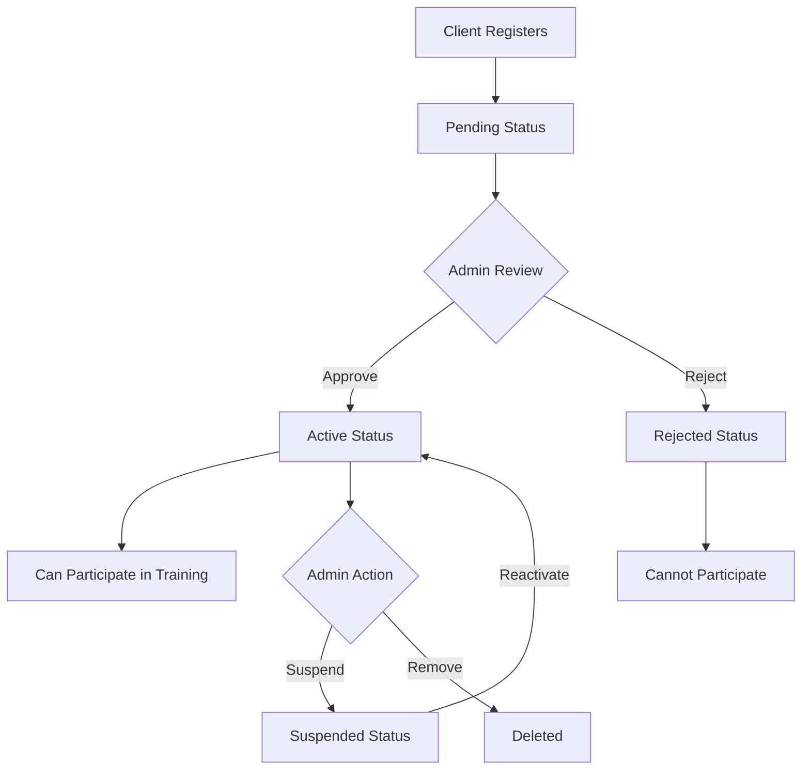

# ICP Federated Learning Authentication System

This document describes the role-based authentication and approval system for the ICP federated learning platform.

## 🔐 Overview

The system implements a comprehensive role-based permission model with the following key features:

- **Role-Based Access Control**: Admin, Server, Client, and Observer roles
- **Pending Approval Workflow**: Clients must be approved by admins before participating
- **Environment-Based Authentication**: Secure credential management via .env files
- **Principal ID Management**: Each entity has unique cryptographic identities
- **Blockchain Audit Trail**: All permissions and approvals recorded on ICP

## 🎭 Roles and Permissions

### 👑 Admin Role
**Full system control and management**

**Permissions:**
- Initialize the system and set admin role
- Approve/reject client registrations
- Remove clients from the system
- Set up server roles
- View all system statistics
- Manage training rounds

**Functions:**
- `init_admin()` - Initialize admin role (one-time setup)
- `admin_approve_client(principal)` - Approve pending client
- `admin_reject_client(principal)` - Reject pending client
- `admin_remove_client(principal)` - Remove client completely
- `admin_set_server(principal)` - Grant server role

### 🖥️ Server Role
**Federated learning coordination**

**Permissions:**
- Start and manage training rounds
- Store model metadata
- View system statistics
- Update round status

**Functions:**
- `start_training_round(participants)` - Start new FL round
- `complete_training_round(...)` - Complete round with metadata
- `update_round_status(...)` - Update training status

### 👥 Client Role
**Federated learning participation**

**Permissions:**
- Submit model updates (only when Active)
- View system statistics
- Update own status

**Functions:**
- `register_client_enhanced()` - Self-register (Pending status)
- `submit_update(model)` - Submit model updates
- `update_client_status(...)` - Update own status

### 👁️ Observer Role
**Read-only access**

**Permissions:**
- View system statistics
- View training round information
- View client information

## 📊 Client Status Workflow



**Status Types:**
- **Pending**: Waiting for admin approval
- **Active**: Approved and can participate in training
- **Rejected**: Registration denied by admin
- **Suspended**: Temporarily blocked by admin
- **Inactive**: Temporarily inactive (self-managed)

## 🚀 Quick Setup

### 1. Automated Setup
```bash
# Run the automated setup script
uv run python setup_icp_auth.py
```

This will:
- Create dfx identities (admin, server, client1-3)
- Generate .env files with principal IDs
- Deploy the ICP canister
- Configure environment files

### 2. Manual Setup

#### Create Identities
```bash
# Create admin identity
dfx identity new admin --storage-mode password-protected
dfx identity use admin
dfx identity get-principal  # Copy this as ICP_ADMIN_PRINCIPAL_ID

# Create server identity
dfx identity new server --storage-mode password-protected
dfx identity use server
dfx identity get-principal  # Copy this as ICP_SERVER_PRINCIPAL_ID

# Create client identity
dfx identity new client1 --storage-mode password-protected
dfx identity use client1
dfx identity get-principal  # Copy this as ICP_CLIENT_PRINCIPAL_ID
```

#### Configure Environment
```bash
# Copy example files
cp .env.example .env
cp client/.env.example client/.env

# Edit .env files with your principal IDs
# Fill in the principal IDs from the previous step
```

#### Deploy and Initialize
```bash
# Deploy canister
cd icp/fl_cvd_backend
dfx start --background
dfx deploy
dfx canister id fl_cvd_backend_backend  # Copy this as ICP_CANISTER_ID

# Initialize admin role
uv run python icp_cli.py init-admin

# Set up server role
uv run python icp_cli.py setup-server <SERVER_PRINCIPAL_ID>
```

## 🎮 Usage Examples

### Admin Operations

```bash
# Initialize admin role (run once after deployment)
uv run python icp_cli.py init-admin

# List clients pending approval
uv run python icp_cli.py pending

# Approve a client
uv run python icp_cli.py approve <CLIENT_PRINCIPAL_ID>

# Reject a client
uv run python icp_cli.py reject <CLIENT_PRINCIPAL_ID>

# Set up server role
uv run python icp_cli.py setup-server <SERVER_PRINCIPAL_ID>
```

### Client Operations

```bash
# Register as a client (will be in Pending status)
uv run python icp_cli.py register

# Check registration status
uv run python icp_cli.py check <YOUR_PRINCIPAL_ID>

# Start client (after approval)
uv run python client/client.py --dataset dataset/clients/client1_data.csv
```

### Server Operations

```bash
# Start federated learning with orchestration
uv run python icp_cli.py train --rounds 3 dataset/clients/*.csv

# Quick training with defaults
uv run python icp_cli.py quick-train --rounds 2
```

## 🔧 Environment Configuration

### Main .env File
```env
# Admin credentials
ICP_ADMIN_PRINCIPAL_ID=your-admin-principal-id
ICP_ADMIN_SEED_PHRASE="your twelve word admin seed phrase"

# Server credentials
ICP_SERVER_PRINCIPAL_ID=your-server-principal-id
ICP_SERVER_SEED_PHRASE="your twelve word server seed phrase"

# Default client credentials
ICP_CLIENT_PRINCIPAL_ID=your-client-principal-id
ICP_CLIENT_SEED_PHRASE="your twelve word client seed phrase"

# Network configuration
ICP_NETWORK=local
ICP_CANISTER_ID=your-canister-id
```

### Client-Specific .env Files
Each client should have their own `.env` file in the `client/` directory:

```env
# client/.env.client1
ICP_CLIENT_PRINCIPAL_ID=client1-specific-principal-id
ICP_CLIENT_SEED_PHRASE="client1 specific seed phrase"
ICP_CLIENT_IDENTITY_NAME=client1

CLIENT_NAME=Healthcare Provider 1
CLIENT_ORGANIZATION=Hospital ABC
CLIENT_LOCATION=City, Country
CLIENT_CONTACT_EMAIL=admin@hospital-abc.com
```

## 🔒 Security Features

### Cryptographic Identity
- Each role uses unique Principal IDs
- Principal IDs are cryptographically secure
- No shared secrets or passwords

### Blockchain Audit Trail
- All role assignments recorded on ICP
- Client approvals/rejections immutable
- Training round participation tracked

### Permission Enforcement
- Function-level permission checks
- Role-based access control
- Status-based participation control

### Environment Security
- Credentials stored in .env files
- .env files excluded from git
- Password-protected dfx identities

## 🚨 Troubleshooting

### Common Issues

**"Identity not found" error:**
```bash
# Create the missing identity
dfx identity new <identity-name> --storage-mode password-protected
```

**"Permission denied" error:**
```bash
# Check your role
uv run python icp_cli.py status

# Make sure you're using the correct identity
dfx identity whoami
dfx identity use <correct-identity>
```

**"Client not approved" error:**
```bash
# Check client status
uv run python icp_cli.py check <CLIENT_PRINCIPAL_ID>

# Admin needs to approve
uv run python icp_cli.py approve <CLIENT_PRINCIPAL_ID>
```

### Reset System
```bash
# Remove all identities and start over
dfx identity remove admin
dfx identity remove server
dfx identity remove client1

# Re-run setup
uv run python setup_icp_auth.py
```

## 📚 API Reference

See the enhanced canister functions in `icp/fl_cvd_backend/src/fl_cvd_backend_backend/main.mo` for complete API documentation.

## 🎯 Next Steps

1. **Production Deployment**: Configure for mainnet deployment
2. **Enhanced Metadata**: Add more client verification fields
3. **Automated Approval**: Implement rule-based auto-approval
4. **Monitoring Dashboard**: Build admin web interface
5. **Audit Logging**: Enhanced logging and monitoring
